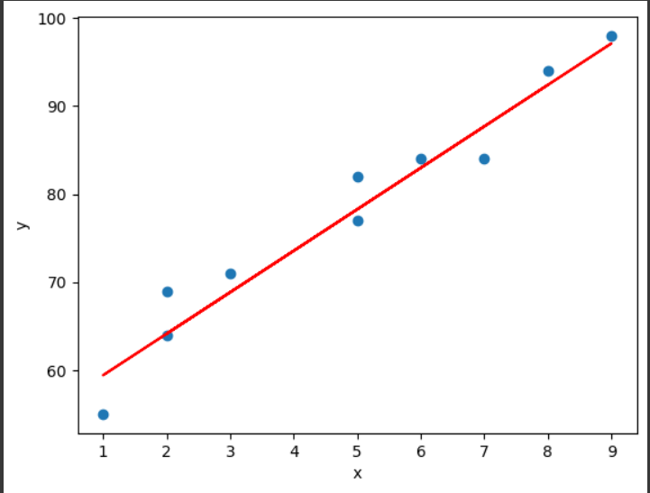

# Implementation-of-Simple-Linear-Regression-Model-for-Predicting-the-Marks-Scored

## AIM:
To write a program to predict the marks scored by a student using the simple linear regression model.

## Equipments Required:
1. Hardware – PCs
2. Anaconda – Python 3.7 Installation / Jupyter notebook

## Algorithm
1. import the modules
2. read the file
3. scatter a graph 
4. end the program

## Program:
```python
'''
Program to implement the simple linear regression model for predicting the marks scored.
Developed by: SUDHIR KUMAR.R 
RegisterNumber: 212223230221
'''
import pandas as pd
import numpy as np
import matplotlib.pyplot as plt
df=pd.read_csv('/content/ml-lab-1.csv')
plt.scatter(df['x'],df['y'])
plt.xlabel('x')
plt.ylabel('y')
x=df.iloc[:,0:1]
y=df.iloc[:,-1]
from sklearn.model_selection import train_test_split
x_train,x_test,y_train,y_test=train_test_split(x,y,test_size=0.2,random_state=0)
from sklearn.linear_model import LinearRegression
lr=LinearRegression()
lr.fit(x_train,y_train)
lr.predict(x_test.iloc[0].values.reshape(1,1))
plt.scatter(df['x'],df['y'])
plt.xlabel('x')
plt.ylabel('y')
plt.plot(x_train,lr.predict(x_train),color='red')
print('coefficients:',lr.coef_)
print('intercept:',lr.intercept_)
```

## Output:

## Head


## Graph of plotted data


## Trained data


## Line of regression



## Coefficient and Intercept values:


## Result:
Thus the program to implement the simple linear regression model for predicting the marks scored is written and verified using python programming.
